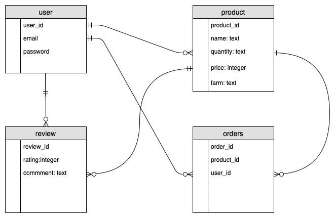

# README

<h2>R7. Identification of the problem you are trying to solve by building this particular marketplace app.</h2>

- Farmers face several problems including having large companies control their flow of sales, profits and quotas that must be met.

- Farmers are often forced to harvest produce when it may not be ready in order to meet the demands of consumers.
- Consumers are not getting the freshest produce available to them due to the time it takes for produce to arrive in store and then onto shelves.
- Consumers may want more of a niche product that typically wouldn't be made available to them in a local supermarket.

<h2> R8. Why is it a problem that needs solving? </h2>

- Farmers are heavily reliant on large supermarket chains to sell their produce. 

- Because of this local produce can be often undercut and force prices down lower when the produce is imported cheaper from an international market. 
- This can then also effect the profits made on the Farmers end. They are expected to produce fruits or vegetables that aren't in season which requires more time and resources to grow. All because supermarkets demand it to be in stock. 
- Farmers need to meet certain quotas for quantities and delivery times which if the conditions aren't met could reduce the final profits received by the Farmer. 
- Consumers don't always have time to visit a Farmers Market.
- Consumers should be able to get the freshest produce for their money and know that they are supporting someone local.

<h2> R9. A link (URL) to your deployed app (i.e. website) </h2>

- https://fast-oasis-27327.herokuapp.com/

<h2>R10. A link to your GitHub repository (repo).</h2>

- https://github.com/AdamCoderAcademy/marketpace_app

<h2>R11. Description of your marketplace app (website), including:</h2>

- Purpose -

The main purpose of Farm to Table is to eliminate the heavy reliance that both buyers and sellers have on large chain supermarkets.

- Functionality / features -

Functionality and Features include being able to buy or sell fresh produce. The user is required to create an account online first before they are able to navigate the site.
- Sitemap

- Screenshots

Index page logged out

Logged in 

Listing View

Current Produce Available

Creating a new listing

After the listing is created

- Target audience - 

 This is aimed at Farmers trying to sell their own produce. And the general population that require or prefer on online store with ease of access to fresh farm produce.

- Tech stack (e.g. html, css, deployment platform, etc)

Tech Stack used was Ruby, HTML, CSS and JavaScript then deployed on Heroku.

<h2>R12.	User stories for your app</h2> 

User Stories

- https://trello.com/b/m2erHRnZ/user-stories

<h2>R13.	Wireframes for your app </h2>

Home page not logged in Desktop

Home page after logging in Desktop

Item Buy page Desktop

Item Sell page Desktop

Item View page Desktop

Home page not logged in Mobile

Home page after logging in Mobile

Item Buy page Mobile

Item Sell page Mobile

Item View page Mobile

<h2>R14.	An ERD for your app</h2>

<h2>R15.	Explain the different high-level components (abstractions) in your app</h2>

Devise - The Devise gem was used for authentication of the user. This consists of a simple sign up requiring a user email and password in order to access their account to buy or sell the produce.

Forms - Forms were used to store and validate product data entry.

AWS - Aws was used as the image database storage.

<h2>R16.	Detail any third party services that your app will use</h2>

- Stripe

Stripe is used as the payment gateway and processes all orders.

- AWS 

AWS is used as the database storage for image uploading when creating a new produce listing

- Heroku 

Heroku was used to deploy my website online.

<h2>R17.	Describe your projects models in terms of the relationships (active record associations) they have with each other</h2>

Users
  - has_many :products, dependent: :destroy
  - has_many :reviews, through: :products

Product
- belongs_to :user
    - has_one_attached :picture
    - has_many :reviews, dependent: :destroy

Review
  - belongs_to :product
  - belongs_to :user

<h2>R18.	Discuss the database relations to be implemented in your application</h2>

- When someone creates an account they become a "user"

- The "user" than has the ability to browse, purchase or create "products" which have their own information fields to be filled out.

- "Users" can then also leave a "review" for a specific "product" and if multiple reviews are left it creates an average score.

<h2>R19.	Provide your database schema design</h2>

ActiveRecord::Schema.define(version: 2020_03_10_051928) do

  # These are extensions that must be enabled in order to support this database
  enable_extension "plpgsql"

  create_table "active_storage_attachments", force: :cascade do |t|

    t.string "name", null: false
    t.string "record_type", null: false
    t.bigint "record_id", null: false
    t.bigint "blob_id", null: false
    t.datetime "created_at", null: false
    t.index ["blob_id"], name: "index_active_storage_attachments_on_blob_id"
    t.index ["record_type", "record_id", "name", "blob_id"], name: "index_active_storage_attachments_uniqueness", unique: true
  end

  create_table "active_storage_blobs", force: :cascade do |t|

    t.string "key", null: false
    t.string "filename", null: false
    t.string "content_type"
    t.text "metadata"
    t.bigint "byte_size", null: false
    t.string "checksum", null: false
    t.datetime "created_at", null: false
    t.index ["key"], name: "index_active_storage_blobs_on_key", unique: true
  end

  create_table "products", force: :cascade do |t|

    t.string "name"
    t.string "quantity"
    t.decimal "price", precision: 8, scale: 2
    t.string "farm"
    t.datetime "created_at", precision: 6, null: false
    t.datetime "updated_at", precision: 6, null: false
    t.bigint "user_id", null: false
    t.index ["user_id"], name: "index_products_on_user_id"
  end

  create_table "reviews", force: :cascade do |t|
  
    t.integer "rating"
    t.text "comment"
    t.bigint "product_id", null: false
    t.bigint "user_id", null: false
    t.datetime "created_at", precision: 6, null: false
    t.datetime "updated_at", precision: 6, null: false
    t.index ["product_id"], name: "index_reviews_on_product_id"
    t.index ["user_id"], name: "index_reviews_on_user_id"
  end

  create_table "users", force: :cascade do |t|

    t.string "email", default: "", null: false
    t.string "encrypted_password", default: "", null: false
    t.string "reset_password_token"
    t.datetime "reset_password_sent_at"
    t.datetime "remember_created_at"
    t.datetime "created_at", precision: 6, null: false
    t.datetime "updated_at", precision: 6, null: false
    t.index ["email"], name: "index_users_on_email", unique: true
    t.index ["reset_password_token"], name: "index_users_on_reset_password_token", unique: true
  end

  add_foreign_key "active_storage_attachments", "active_storage_blobs", column: "blob_id"
  add_foreign_key "products", "users"
  add_foreign_key "reviews", "products"
  add_foreign_key "reviews", "users"
end

<h2>R20.	Describe the way tasks are allocated and tracked in your project</h2>

- First I wrote down notes of what my application might be, after deciding to go with a Farmers Market I started with user stories. 
- Then with making basic wireframes. 
- I sourced some free images online to use as a possible background and for colour guidance. The images were also used for the produce. 
- I wrote down notes of what the application should do and then 
created the ERD. 
- Originally my idea was much larger than what was produced but running out of time I went with the agile approach and dropped some of my functionality and focused solely on the MVP. 
- I asked for help debugging from some of the class mates and had them create accounts to make sure my app was working as intended. 
- Certain errors were only found after testing while the site was live which included problems with my image upload and deleting products or reviews which has since all been fixed. 